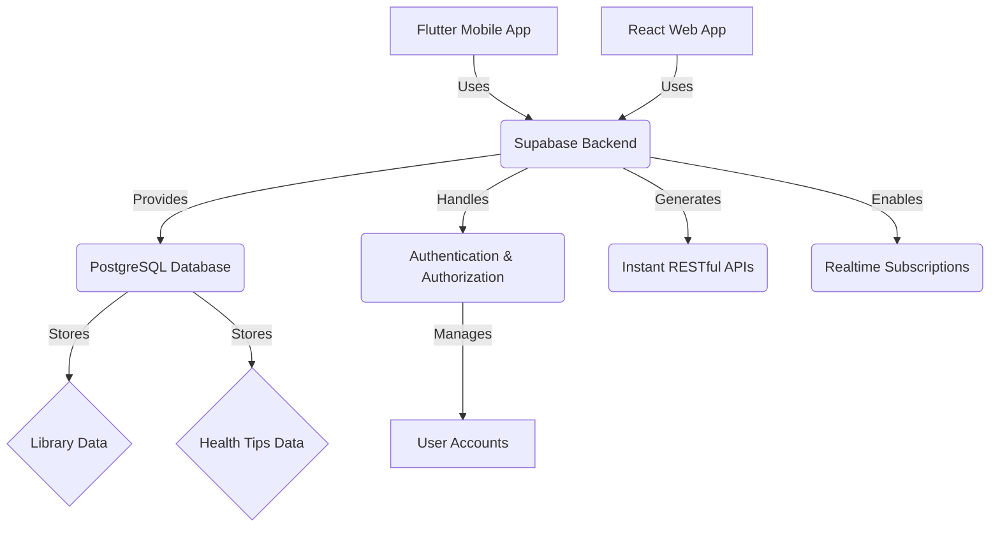

# Project Documentation: Library Mobile App and Health Tips Web App

## 1. Introduction

This document provides comprehensive technical documentation for the development of a dual-application project: a library mobile application and a health tips web application. Both applications are designed to serve community members and the general public, leveraging modern technology stacks to ensure scalability, maintainability, and a rich user experience. The backend infrastructure will be powered by Supabase, a robust open-source platform providing a PostgreSQL database, authentication, instant APIs, and real-time subscriptions. The mobile application will be developed using Flutter, Google's UI toolkit for building natively compiled applications for mobile, web, and desktop from a single codebase. The web application will be built with React, a popular JavaScript library for building user interfaces.

This documentation aims to serve as a central reference for developers, stakeholders, and future contributors, detailing the project's architecture, technical specifications, development guidelines, and deployment procedures. It covers the rationale behind technology choices, system design, API interactions, and specific implementation considerations for both the mobile and web platforms.

## 2. Project Overview

### 2.1. Purpose and Scope

The primary purpose of this project is to provide accessible and valuable resources to community members and the general public through two distinct, yet interconnected, applications. The library mobile app will streamline access to library resources, while the health tips web app will offer practical health information. Both applications aim to enhance user engagement and provide utility in their respective domains.

#### 2.1.1. Library Mobile Application

The library mobile application is designed to modernize and simplify the process of accessing library services for community members and other patrons. Its scope includes features that facilitate resource discovery, borrowing, and account management, aiming to provide a seamless mobile experience for library users.

#### 2.1.2. Health Tips Web Application

The health tips web application is intended to be a readily available source of reliable health information for a broad audience. Its scope encompasses delivering curated health advice, tips, and educational content in an easily digestible format, promoting general well-being and informed health decisions.

### 2.2. Target Audience

#### 2.2.1. Library Mobile Application

The primary target audience for the library mobile application includes:
*   **Community Members:** University, college, and school students who frequently use library resources for academic purposes.
*   **General Public:** Community members who utilize public library services for leisure reading, research, or personal development.
*   **Library Staff:** For administrative features (if applicable in future phases) to manage resources and user interactions.

#### 2.2.2. Health Tips Web Application

The primary target audience for the health tips web application includes:
*   **Community Members:** Seeking quick and reliable health advice related to academic stress, diet, exercise, and general well-being.
*   **General Public:** Individuals interested in maintaining a healthy lifestyle, seeking preventive health information, or looking for practical health tips.
*   **Educators/Health Professionals:** Potentially using the platform as a supplementary resource for health education.


### 2.3. Key Features and Functionalities

#### 2.3.1. Library Mobile Application Features

The library mobile application will offer the following core functionalities:

*   **User Authentication and Profile Management:** Secure login/registration, user profile viewing and editing, password management.
*   **Search and Discovery:** Advanced search capabilities for books, journals, articles, and other library materials. Filtering and sorting options based on categories, authors, publication dates, and availability.
*   **Borrowing and Reservations:** Ability to check item availability, reserve items, and view current loans and borrowing history. Notifications for due dates and overdue items.
*   **Digital Resources Access:** Direct access to e-books, online journals, and other digital content integrated with the library's digital collection.
*   **Branch Information:** Location details, operating hours, and contact information for various library branches.
*   **Notifications:** Push notifications for new arrivals, reservation status updates, and library announcements.
*   **Offline Access (Partial):** Ability to access certain downloaded digital resources or cached information without an internet connection.

#### 2.3.2. Health Tips Web Application Features

The health tips web application will provide the following key functionalities:

*   **Content Browsing and Search:** Categorized health tips (e.g., nutrition, fitness, mental health, sleep), search functionality for specific topics.
*   **Personalized Content (Optional for future phase):** User accounts to save favorite tips, track progress, or receive personalized recommendations based on preferences.
*   **Educational Articles and Guides:** In-depth articles, infographics, and guides on various health-related subjects.
*   **Multimedia Content:** Integration of videos, audio clips, and images to enhance learning and engagement.
*   **User Contributions (Optional for future phase):** Ability for users to submit health tips or share experiences, subject to moderation.
*   **Newsletter Subscription:** Option for users to subscribe to a regular health tips newsletter.
*   **Responsive Design:** Optimized for viewing across various devices, including desktops, tablets, and mobile phones.

### 2.4. Non-Functional Requirements

To ensure the applications are robust, reliable, and user-friendly, the following non-functional requirements will be adhered to:

*   **Performance:**
    *   **Response Time:** API responses and page load times should be minimal, ideally under 2 seconds for critical operations.
    *   **Scalability:** The system must be able to handle a growing number of users and data without significant degradation in performance. Supabase's scalability features will be leveraged.
    *   **Concurrency:** The backend must support a high number of concurrent users accessing and interacting with the applications.
*   **Security:**
    *   **Authentication and Authorization:** Implement secure user authentication (Supabase Auth) and role-based access control to protect sensitive data.
    *   **Data Encryption:** All data in transit and at rest must be encrypted.
    *   **Vulnerability Management:** Regular security audits and penetration testing to identify and address potential vulnerabilities.
    *   **Input Validation:** Robust input validation to prevent common web vulnerabilities such as SQL injection and cross-site scripting (XSS).
*   **Reliability and Availability:**
    *   **Uptime:** The applications and backend services should aim for a high uptime percentage (e.g., 99.9%).
    *   **Data Backup and Recovery:** Regular data backups and a clear recovery plan in case of data loss or system failure.
    *   **Error Handling:** Comprehensive error logging and graceful error handling to provide a smooth user experience even during unexpected issues.
*   **Usability:**
    *   **Intuitive User Interface:** Both applications must have a clean, intuitive, and easy-to-navigate user interface.
    *   **Accessibility:** Adherence to accessibility guidelines (e.g., WCAG) to ensure the applications are usable by individuals with disabilities.
    *   **Consistency:** Consistent design language, navigation patterns, and user experience across both mobile and web platforms.
*   **Maintainability:**
    *   **Code Quality:** Adherence to coding standards, best practices, and clear documentation within the codebase.
    *   **Modularity:** Modular design to facilitate easier updates, bug fixes, and feature additions.
    *   **Testability:** Code should be easily testable with unit, integration, and end-to-end tests.
*   **Compatibility:**
    *   **Mobile App:** Compatibility with recent versions of iOS and Android operating systems.
    *   **Web App:** Cross-browser compatibility (Chrome, Firefox, Safari, Edge) and responsiveness across various screen sizes.
*   **Extensibility:** The architecture should allow for easy integration of new features or third-party services in the future.
*   **Cost-Effectiveness:** Optimize resource utilization to minimize operational costs while maintaining performance and reliability.


## 3. System Architecture and Database Schema Design

### 3.1. Overall System Architecture

The project's architecture is designed to be modular, scalable, and maintainable, leveraging a serverless backend approach with Supabase. This setup allows for rapid development and deployment while providing robust data management and authentication capabilities. The architecture consists of three main components:

1.  **Frontend Applications:** The Flutter mobile application and the React web application serve as the user interfaces, responsible for presenting data and capturing user interactions.
2.  **Backend Services (Supabase):** Supabase acts as the central backend, providing a PostgreSQL database, real-time capabilities, authentication, and instant APIs. It abstracts away much of the traditional backend development, allowing frontend teams to focus on user experience.
3.  **External Services (Optional):** Depending on future requirements, external services such as payment gateways, analytics platforms, or third-party content providers can be integrated.

**Architectural Diagram Overview:**



**Component Responsibilities:**

*   **Flutter Mobile App:** Handles native mobile UI rendering, user input, and communicates with Supabase via its client SDK for data operations and authentication.
*   **React Web App:** Manages web UI rendering, user input, and interacts with Supabase through its client SDK for data retrieval, updates, and authentication.
*   **Supabase Backend:**
    *   **PostgreSQL Database:** Stores all application data, including user information, library resources, and health tips.
    *   **Authentication:** Manages user registration, login, session management, and role-based access control (RBAC).
    *   **Instant RESTful APIs:** Automatically generated APIs for CRUD (Create, Read, Update, Delete) operations on database tables, accessible via HTTP.
    *   **Realtime Subscriptions:** Provides real-time updates to connected clients when data in the database changes, useful for features like live chat or instant notifications.
    *   **Edge Functions (Serverless Functions):** Allows for custom backend logic to be executed in a serverless environment, useful for complex business logic or integrations not covered by instant APIs.

### 3.2. Database Schema Design

The database schema is designed to support the functionalities of both the library mobile app and the health tips web app. It will be implemented in PostgreSQL within Supabase. Below are the proposed tables and their relationships.

#### 3.2.1. Common Tables

These tables will be shared across both applications, primarily for user management.

*   **`users` Table:**
    *   `id` (UUID, Primary Key, Supabase Auth `auth.users.id`): Unique identifier for the user.
    *   `email` (TEXT, Unique): User's email address.
    *   `created_at` (TIMESTAMP WITH TIME ZONE, Default NOW()): Timestamp of user creation.
    *   `updated_at` (TIMESTAMP WITH TIME ZONE, Default NOW()): Timestamp of last update.
    *   `full_name` (TEXT, Nullable): User's full name.
    *   `avatar_url` (TEXT, Nullable): URL to user's profile picture.
    *   `role` (TEXT, Default 'user'): User's role (e.g., 'user', 'admin', 'librarian').

#### 3.2.2. Library Mobile Application Tables

These tables are specific to the library management functionalities.

*   **`books` Table:**
    *   `id` (UUID, Primary Key, Default GEN_RANDOM_UUID()): Unique identifier for the book.
    *   `title` (TEXT, Not Null): Title of the book.
    *   `author` (TEXT, Not Null): Author(s) of the book.
    *   `isbn` (TEXT, Unique, Nullable): International Standard Book Number.
    *   `publication_year` (INTEGER, Nullable): Year of publication.
    *   `genre` (TEXT, Nullable): Genre of the book.
    *   `description` (TEXT, Nullable): Short description or synopsis.
    *   `cover_image_url` (TEXT, Nullable): URL to the book cover image.
    *   `total_copies` (INTEGER, Default 1): Total number of copies available.
    *   `available_copies` (INTEGER, Default 1): Number of currently available copies.
    *   `created_at` (TIMESTAMP WITH TIME ZONE, Default NOW()): Timestamp of record creation.
    *   `updated_at` (TIMESTAMP WITH TIME ZONE, Default NOW()): Timestamp of last update.

*   **`loans` Table:**
    *   `id` (UUID, Primary Key, Default GEN_RANDOM_UUID()): Unique identifier for the loan.
    *   `user_id` (UUID, Foreign Key to `users.id`, Not Null): ID of the user who borrowed the book.
    *   `book_id` (UUID, Foreign Key to `books.id`, Not Null): ID of the borrowed book.
    *   `loan_date` (TIMESTAMP WITH TIME ZONE, Default NOW()): Date and time the book was borrowed.
    *   `due_date` (TIMESTAMP WITH TIME ZONE, Not Null): Date and time the book is due.
    *   `return_date` (TIMESTAMP WITH TIME ZONE, Nullable): Date and time the book was returned.
    *   `status` (TEXT, Not Null, Default 'borrowed'): Current status of the loan (e.g., 'borrowed', 'returned', 'overdue').
    *   `created_at` (TIMESTAMP WITH TIME ZONE, Default NOW()): Timestamp of record creation.
    *   `updated_at` (TIMESTAMP WITH TIME ZONE, Default NOW()): Timestamp of last update.

*   **`reservations` Table:**
    *   `id` (UUID, Primary Key, Default GEN_RANDOM_UUID()): Unique identifier for the reservation.
    *   `user_id` (UUID, Foreign Key to `users.id`, Not Null): ID of the user who made the reservation.
    *   `book_id` (UUID, Foreign Key to `books.id`, Not Null): ID of the reserved book.
    *   `reservation_date` (TIMESTAMP WITH TIME ZONE, Default NOW()): Date and time the reservation was made.
    *   `status` (TEXT, Not Null, Default 'pending'): Status of the reservation (e.g., 'pending', 'ready_for_pickup', 'cancelled').
    *   `created_at` (TIMESTAMP WITH TIME ZONE, Default NOW()): Timestamp of record creation.
    *   `updated_at` (TIMESTAMP WITH TIME ZONE, Default NOW()): Timestamp of last update.

#### 3.2.3. Health Tips Web Application Tables

These tables are specific to the health tips content management.

*   **`health_tips` Table:**
    *   `id` (UUID, Primary Key, Default GEN_RANDOM_UUID()): Unique identifier for the health tip.
    *   `title` (TEXT, Not Null): Title of the health tip.
    *   `content` (TEXT, Not Null): Full content of the health tip (can be Markdown or HTML).
    *   `category` (TEXT, Not Null): Category of the tip (e.g., 'Nutrition', 'Fitness', 'Mental Health', 'Sleep').
    *   `author_id` (UUID, Foreign Key to `users.id`, Nullable): ID of the user who authored the tip (if applicable).
    *   `published_at` (TIMESTAMP WITH TIME ZONE, Nullable): Date and time the tip was published.
    *   `image_url` (TEXT, Nullable): URL to a featured image for the tip.
    *   `tags` (TEXT[], Nullable): Array of tags for easier search and filtering.
    *   `created_at` (TIMESTAMP WITH TIME ZONE, Default NOW()): Timestamp of record creation.
    *   `updated_at` (TIMESTAMP WITH TIME ZONE, Default NOW()): Timestamp of last update.

*   **`comments` Table (Optional for future phase):**
    *   `id` (UUID, Primary Key, Default GEN_RANDOM_UUID()): Unique identifier for the comment.
    *   `health_tip_id` (UUID, Foreign Key to `health_tips.id`, Not Null): ID of the health tip the comment belongs to.
    *   `user_id` (UUID, Foreign Key to `users.id`, Not Null): ID of the user who made the comment.
    *   `comment_text` (TEXT, Not Null): The content of the comment.
    *   `created_at` (TIMESTAMP WITH TIME ZONE, Default NOW()): Timestamp of comment creation.

### 3.3. Authentication and Authorization with Supabase Auth

Supabase Auth provides a comprehensive solution for user authentication and authorization, seamlessly integrating with the PostgreSQL database. It supports various authentication methods and allows for fine-grained access control using Row Level Security (RLS).

#### 3.3.1. Authentication Flows

Supabase Auth will be used to manage user authentication for both applications. Key flows include:

*   **Email and Password Authentication:** Users can sign up and log in using their email address and a secure password. Supabase handles password hashing and secure storage.
*   **Social Logins (Optional):** Supabase supports integration with various OAuth providers (e.g., Google, GitHub, Facebook), allowing users to sign up and log in using their existing social accounts. This can be added in a future phase.
*   **Magic Link Authentication:** Users can receive a one-time login link via email, providing a passwordless authentication experience.
*   **Password Reset:** Secure mechanism for users to reset forgotten passwords via email.
*   **Email Confirmation:** Optional email verification process to confirm user email addresses upon registration.

#### 3.3.2. Authorization with Row Level Security (RLS)

Supabase leverages PostgreSQL's Row Level Security (RLS) to enforce authorization policies directly at the database level. This ensures that users can only access or modify data they are authorized to, regardless of the application client used.

**Key Principles of RLS Implementation:**

*   **Default Deny:** By default, all access to tables will be denied. Policies will be explicitly created to grant access.
*   **User-Based Access:** Policies will be defined to allow users to read, insert, update, or delete their own data (e.g., a user can only view their own loans or reservations).
*   **Role-Based Access:** Different roles (e.g., 'user', 'admin', 'librarian') will have different permissions. For instance, an 'admin' might have full access to all tables, while a 'librarian' might have specific write access to `books` and `loans` tables.
*   **Public Read Access:** Certain tables, like `books` (for searching) and `health_tips` (for general browsing), might have public read access for unauthenticated users or all authenticated users.

**Example RLS Policies (Conceptual):**

*   **`users` table:**
    *   `SELECT`: Allow users to read their own profile (`auth.uid() = id`).
    *   `UPDATE`: Allow users to update their own profile (`auth.uid() = id`).
*   **`books` table:**
    *   `SELECT`: Allow all authenticated users to read all book information.
    *   `INSERT`, `UPDATE`, `DELETE`: Only allow 'librarian' or 'admin' roles.
*   **`loans` table:**
    *   `SELECT`: Allow users to read their own loans (`auth.uid() = user_id`). Allow 'librarian' or 'admin' to read all loans.
    *   `INSERT`: Allow 'librarian' to create new loans.
    *   `UPDATE`: Allow 'librarian' to update loan status (e.g., return date).
*   **`health_tips` table:**
    *   `SELECT`: Allow all users (authenticated and unauthenticated) to read all health tips.
    *   `INSERT`, `UPDATE`, `DELETE`: Only allow 'admin' or specific 'content_creator' roles.

These policies will be carefully crafted and tested within the Supabase environment to ensure data integrity and security.


## 4. API Documentation and Integration Guides

Supabase automatically generates RESTful APIs for every table in your PostgreSQL database, providing a powerful and flexible way for your frontend applications to interact with the backend. These APIs are instantly available and secured by Supabase's authentication and Row Level Security (RLS) policies.

### 4.1. Supabase API Overview

Supabase APIs are built on top of PostgREST, which turns your PostgreSQL database directly into a RESTful API. This means that as you define your database schema, the corresponding API endpoints are automatically created and kept in sync. This significantly reduces the need for writing custom backend API code.

Key characteristics of Supabase APIs:

*   **Instant:** APIs are generated in real-time as you define your database schema.
*   **RESTful:** Follows standard REST principles, using HTTP methods (GET, POST, PUT, PATCH, DELETE) for operations.
*   **Secure:** Integrated with Supabase Auth and RLS, ensuring that only authorized users can access or modify data.
*   **Realtime:** Supports real-time subscriptions for instant data updates.
*   **Client Libraries:** Supabase provides client libraries for various platforms (including Flutter and JavaScript/React) that simplify interaction with these APIs.

### 4.2. General API Interaction Principles

All API requests to Supabase require an `Authorization` header containing a valid JWT (JSON Web Token) for authenticated requests, and an `apikey` header for project identification. Supabase client libraries handle these details automatically.

**Base URL:** The base URL for your Supabase API will be specific to your project, typically in the format `https://<your-project-ref>.supabase.co/rest/v1/`.

**Authentication:** After a user logs in via Supabase Auth, a JWT is returned. This token must be included in the `Authorization` header of subsequent API requests as a Bearer token.

```
Authorization: Bearer <your-jwt-token>
apikey: <your-supabase-anon-key>
```

### 4.3. API Examples for Library Mobile Application (Flutter)

This section provides conceptual examples of how the Flutter application will interact with the Supabase API using the `supabase_flutter` client library.

#### 4.3.1. Initializing Supabase Client

First, ensure the Supabase client is initialized in your Flutter application, typically in your `main.dart` or a dedicated service file.

```dart
import 'package:supabase_flutter/supabase_flutter.dart';

Future<void> main() async {
  await Supabase.initialize(
    url: 'YOUR_SUPABASE_URL',
    anonKey: 'YOUR_SUPABASE_ANON_KEY',
  );
  runApp(MyApp());
}

// Access the client
final supabase = Supabase.instance.client;
```

#### 4.3.2. User Authentication

Conceptual example for user sign-up and sign-in.

**Sign Up:**

```dart
Future<void> signUp(String email, String password) async {
  try {
    final AuthResponse res = await supabase.auth.signUp(
      email: email,
      password: password,
    );
    // Handle successful sign up (e.g., navigate to email verification page)
    print('User signed up: ${res.user?.email}');
  } on AuthException catch (e) {
    // Handle sign up error
    print('Sign up error: ${e.message}');
  }
}
```

**Sign In:**

```dart
Future<void> signIn(String email, String password) async {
  try {
    final AuthResponse res = await supabase.auth.signInWithPassword(
      email: email,
      password: password,
    );
    // Handle successful sign in (e.g., navigate to home page)
    print('User signed in: ${res.user?.email}');
  } on AuthException catch (e) {
    // Handle sign in error
    print('Sign in error: ${e.message}');
  }
}
```

#### 4.3.3. CRUD Operations for `books` Table

**Read All Books:**

```dart
Future<List<Map<String, dynamic>>> fetchAllBooks() async {
  try {
    final List<Map<String, dynamic>> books = await supabase
        .from('books')
        .select('*');
    return books;
  } catch (e) {
    print('Error fetching books: $e');
    return [];
  }
}
```

**Read a Single Book by ID:**

```dart
Future<Map<String, dynamic>?> fetchBookById(String bookId) async {
  try {
    final Map<String, dynamic>? book = await supabase
        .from('books')
        .select('*')
        .eq('id', bookId)
        .single();
    return book;
  } catch (e) {
    print('Error fetching book: $e');
    return null;
  }
}
```

**Add a New Book (Admin/Librarian Role):**

```dart
Future<void> addBook(Map<String, dynamic> newBookData) async {
  try {
    await supabase
        .from('books')
        .insert(newBookData);
    print('Book added successfully');
  } catch (e) {
    print('Error adding book: $e');
  }
}
```

**Update Book Information (Admin/Librarian Role):**

```dart
Future<void> updateBook(String bookId, Map<String, dynamic> updatedData) async {
  try {
    await supabase
        .from('books')
        .update(updatedData)
        .eq('id', bookId);
    print('Book updated successfully');
  } catch (e) {
    print('Error updating book: $e');
  }
}
```

**Delete a Book (Admin/Librarian Role):**

```dart
Future<void> deleteBook(String bookId) async {
  try {
    await supabase
        .from('books')
        .delete()
        .eq('id', bookId);
    print('Book deleted successfully');
  } catch (e) {
    print('Error deleting book: $e');
  }
}
```

#### 4.3.4. CRUD Operations for `loans` and `reservations` Tables

Similar patterns apply to `loans` and `reservations` tables, with RLS ensuring users can only manage their own loans/reservations, and librarians/admins have broader access.

**Example: Create a Loan (Librarian Role):**

```dart
Future<void> createLoan(String userId, String bookId, DateTime dueDate) async {
  try {
    await supabase
        .from('loans')
        .insert({
          'user_id': userId,
          'book_id': bookId,
          'due_date': dueDate.toIso8601String(),
        });
    print('Loan created successfully');
  } catch (e) {
    print('Error creating loan: $e');
  }
}
```

**Example: Fetch User's Loans:**

```dart
Future<List<Map<String, dynamic>>> fetchUserLoans(String userId) async {
  try {
    final List<Map<String, dynamic>> loans = await supabase
        .from('loans')
        .select('*')
        .eq('user_id', userId);
    return loans;
  } catch (e) {
    print('Error fetching user loans: $e');
    return [];
  }
}
```

### 4.4. API Examples for Health Tips Web Application (React)

This section provides conceptual examples of how the React application will interact with the Supabase API using the `@supabase/supabase-js` client library.

#### 4.4.1. Initializing Supabase Client

Initialize the Supabase client in your React application, typically in a dedicated `supabaseClient.js` file or within a context provider.

```javascript
import { createClient } from '@supabase/supabase-js';

const supabaseUrl = 'YOUR_SUPABASE_URL';
const supabaseAnonKey = 'YOUR_SUPABASE_ANON_KEY';

export const supabase = createClient(supabaseUrl, supabaseAnonKey);
```

#### 4.4.2. User Authentication

Conceptual example for user sign-up and sign-in.

**Sign Up:**

```javascript
import { supabase } from './supabaseClient';

async function signUp(email, password) {
  try {
    const { data, error } = await supabase.auth.signUp({
      email: email,
      password: password,
    });
    if (error) throw error;
    console.log('User signed up:', data.user);
    // Handle successful sign up
  } catch (error) {
    console.error('Sign up error:', error.message);
    // Handle sign up error
  }
}
```

**Sign In:**

```javascript
import { supabase } from './supabaseClient';

async function signIn(email, password) {
  try {
    const { data, error } = await supabase.auth.signInWithPassword({
      email: email,
      password: password,
    });
    if (error) throw error;
    console.log('User signed in:', data.user);
    // Handle successful sign in
  } catch (error) {
    console.error('Sign in error:', error.message);
    // Handle sign in error
  }
}
```

#### 4.4.3. CRUD Operations for `health_tips` Table

**Read All Health Tips:**

```javascript
import { supabase } from './supabaseClient';

async function fetchAllHealthTips() {
  try {
    const { data, error } = await supabase
      .from('health_tips')
      .select('*');
    if (error) throw error;
    return data;
  } catch (error) {
    console.error('Error fetching health tips:', error.message);
    return [];
  }
}
```

**Read a Single Health Tip by ID:**

```javascript
import { supabase } from './supabaseClient';

async function fetchHealthTipById(tipId) {
  try {
    const { data, error } = await supabase
      .from('health_tips')
      .select('*')
      .eq('id', tipId)
      .single();
    if (error) throw error;
    return data;
  } catch (error) {
    console.error('Error fetching health tip:', error.message);
    return null;
  }
}
```

**Add a New Health Tip (Admin/Content Creator Role):**

```javascript
import { supabase } from './supabaseClient';

async function addHealthTip(newTipData) {
  try {
    const { data, error } = await supabase
      .from('health_tips')
      .insert([newTipData]);
    if (error) throw error;
    console.log('Health tip added successfully:', data);
  } catch (error) {
    console.error('Error adding health tip:', error.message);
  }
}
```

**Update Health Tip Information (Admin/Content Creator Role):**

```javascript
import { supabase } from './supabaseClient';

async function updateHealthTip(tipId, updatedData) {
  try {
    const { data, error } = await supabase
      .from('health_tips')
      .update(updatedData)
      .eq('id', tipId);
    if (error) throw error;
    console.log('Health tip updated successfully:', data);
  } catch (error) {
    console.error('Error updating health tip:', error.message);
  }
}
```

**Delete a Health Tip (Admin/Content Creator Role):**

```javascript
import { supabase } from './supabaseClient';

async function deleteHealthTip(tipId) {
  try {
    const { data, error } = await supabase
      .from('health_tips')
      .delete()
      .eq('id', tipId);
    if (error) throw error;
    console.log('Health tip deleted successfully:', data);
  } catch (error) {
    console.error('Error deleting health tip:', error.message);
  }
}
```

These examples provide a foundation for interacting with the Supabase backend from both Flutter and React applications. Developers should refer to the official Supabase documentation for more advanced queries, real-time subscriptions, and specific error handling strategies.


## 5. Flutter Mobile App Setup and Development Guide

This section provides a comprehensive guide for setting up the development environment for the Flutter mobile application, outlining the project structure, integrating with Supabase, and offering guidelines for UI component development.

### 5.1. Setting Up the Flutter Development Environment

To develop Flutter applications, you need to install the Flutter SDK and configure your development environment. This guide assumes you are using Visual Studio Code as your IDE, but the steps are similar for Android Studio or other editors.

#### 5.1.1. Install Flutter SDK

1.  **Download the Flutter SDK:** Visit the official Flutter website [1] and download the Flutter SDK for your operating system (Windows, macOS, Linux).
2.  **Extract the Archive:** Extract the downloaded archive to a desired location on your computer (e.g., `C:\src\flutter` on Windows, `~/development/flutter` on macOS/Linux).
3.  **Add Flutter to your PATH:** Add the `flutter\bin` directory to your system's PATH variable. This allows you to run Flutter commands from any terminal.
    *   **Windows:** Search for "Environment Variables," click "Environment Variables...", select "Path" under "System variables," click "Edit," and add the path to your `flutter\bin` directory.
    *   **macOS/Linux:** Open your `~/.bashrc`, `~/.zshrc`, or `~/.profile` file and add the line: `export PATH="$PATH:[PATH_TO_FLUTTER_DIRECTORY]/bin"`. Then, run `source ~/.bashrc` (or your respective file) to refresh the terminal.
4.  **Run `flutter doctor`:** Open a new terminal or command prompt and run `flutter doctor`. This command checks your environment and displays a report of the status of your Flutter installation. It will also guide you through installing any missing dependencies (e.g., Android SDK, Xcode, VS Code extensions).

#### 5.1.2. Install IDE and Extensions

1.  **Visual Studio Code (VS Code):** Download and install VS Code from the official website [2].
2.  **Flutter and Dart Extensions:** Open VS Code, go to the Extensions view (Ctrl+Shift+X or Cmd+Shift+X), and search for "Flutter" and "Dart." Install both extensions. These extensions provide syntax highlighting, code completion, debugging support, and other Flutter-specific functionalities.

#### 5.1.3. Set Up Android Development (for Android Emulators/Devices)

1.  **Android Studio:** Download and install Android Studio from the official website [3]. This includes the Android SDK, Android SDK Command-line Tools, and Android SDK Build-Tools, which are necessary for Android development.
2.  **Configure Android SDK:** In Android Studio, go to `Tools > SDK Manager` to ensure you have the necessary Android SDK Platforms and SDK Tools installed. Flutter typically requires Android SDK Platform 31 or higher.
3.  **Set Up Android Emulator:** In Android Studio, go to `Tools > Device Manager` to create and manage Android Virtual Devices (AVDs) for emulation.
4.  **Accept Android Licenses:** Run `flutter doctor --android-licenses` in your terminal and accept all licenses.

#### 5.1.4. Set Up iOS Development (for iOS Simulators/Devices - macOS only)

1.  **Xcode:** Install Xcode from the Mac App Store. This is required for iOS development.
2.  **Xcode Command Line Tools:** After installing Xcode, open a terminal and run: `sudo xcode-select --install`.
3.  **Configure Xcode:** Open Xcode, go to `Xcode > Preferences > Locations`, and make sure the "Command Line Tools" dropdown is set to the correct Xcode version.
4.  **Set Up iOS Simulator:** Open Xcode, go to `Xcode > Open Developer Tool > Simulator` to launch the iOS Simulator.

### 5.2. Project Structure and Coding Conventions

#### 5.2.1. Project Structure

When you create a new Flutter project using `flutter create <project_name>`, Flutter generates a standard project structure. Adhering to a consistent and logical project structure is crucial for maintainability and scalability.

```
lib/
├── api/             # Supabase API interaction services
├── auth/            # Authentication related widgets and logic
├── components/      # Reusable UI widgets (e.g., buttons, cards)
├── models/          # Data models (e.g., Book, HealthTip, User)
├── screens/         # Top-level screens/pages of the application
│   ├── library/
│   │   ├── library_home_screen.dart
│   │   └── book_detail_screen.dart
│   ├── health_tips/
│   │   ├── health_tips_list_screen.dart
│   │   └── health_tip_detail_screen.dart
│   └── auth/
│       ├── login_screen.dart
│       └── signup_screen.dart
├── services/        # Business logic, utility functions, non-UI related services
├── utils/           # Helper functions, constants, theme data
├── main.dart        # Entry point of the application
└── routes.dart      # Application routing definitions
```

**Explanation of Directories:**

*   **`lib/api/`**: Contains classes responsible for interacting with the Supabase API. This layer abstracts the data fetching and manipulation logic from the UI.
*   **`lib/auth/`**: Holds widgets, providers, and logic specifically for user authentication (login, signup, password reset).
*   ****`lib/components/`**: Houses small, reusable UI widgets that can be used across different screens. This promotes reusability and consistency.
*   **`lib/models/`**: Defines Dart classes that represent the data structures (e.g., `Book`, `HealthTip`, `User`) fetched from or sent to the Supabase database. These models often use `json_serializable` for easy JSON serialization/deserialization.
*   **`lib/screens/`**: Contains the main UI screens or pages of the application. Each sub-directory within `screens` can represent a major feature area (e.g., `library`, `health_tips`, `auth`).
*   **`lib/services/`**: For services that encapsulate business logic, data processing, or interactions with external APIs (other than Supabase, if any). Examples include notification services, data validation, etc.
*   **`lib/utils/`**: For general utility functions, constants, theme definitions, and other common resources.
*   **`main.dart`**: The entry point of the Flutter application, where `runApp()` is called and the root widget is defined.
*   **`routes.dart`**: Defines the navigation routes within the application, making routing centralized and manageable.

#### 5.2.2. Coding Conventions

Adhering to consistent coding conventions improves code readability, maintainability, and collaboration.

*   **Dart Style Guide:** Follow the official Dart style guide [4] for naming conventions, formatting, and best practices.
*   **Widget Naming:** Use `PascalCase` for widget names (e.g., `MyCustomButton`, `HomeScreen`).
*   **File Naming:** Use `snake_case` for file names (e.g., `my_custom_button.dart`, `home_screen.dart`).
*   **State Management:** Choose a consistent state management solution (e.g., Provider, Riverpod, BLoC, GetX) and apply it uniformly across the project.
*   **Comments:** Use comments to explain complex logic, non-obvious decisions, or public APIs.
*   **Constants:** Define constants in a dedicated `utils/constants.dart` file or similar, especially for strings, numbers, and colors.
*   **Error Handling:** Implement robust error handling using `try-catch` blocks for asynchronous operations and display user-friendly error messages.

### 5.3. Integrating Supabase Client Libraries into Flutter

Integrating Supabase into your Flutter application involves adding the necessary dependencies and initializing the Supabase client.

#### 5.3.1. Add Dependencies

Open your `pubspec.yaml` file and add the `supabase_flutter` package under `dependencies`:

```yaml
dependencies:
  flutter:
    sdk: flutter
  supabase_flutter: ^1.x.x # Use the latest stable version
  # Add other dependencies as needed
```

After adding the dependency, run `flutter pub get` in your terminal to fetch the package.

#### 5.3.2. Initialize Supabase Client

As shown in the API documentation section, initialize the Supabase client in your `main.dart` file or a suitable entry point.

```dart
import 'package:flutter/material.dart';
import 'package:supabase_flutter/supabase_flutter.dart';

void main() async {
  WidgetsFlutterBinding.ensureInitialized();

  await Supabase.initialize(
    url: 'YOUR_SUPABASE_URL',
    anonKey: 'YOUR_SUPABASE_ANON_KEY',
  );

  runApp(const MyApp());
}

class MyApp extends StatelessWidget {
  const MyApp({super.key});

  @override
  Widget build(BuildContext context) {
    return MaterialApp(
      title: 'Library App',
      theme: ThemeData.light().copyWith(
        primaryColor: Colors.green,
        textButtonTheme: TextButtonThemeData(
          style: TextButton.styleFrom(
            foregroundColor: Colors.green,
          ),
        ),
        elevatedButtonTheme: ElevatedButtonThemeData(
          style: ElevatedButton.styleFrom(
            foregroundColor: Colors.white,
            backgroundColor: Colors.green,
          ),
        ),
      ),
      home: const AuthRequiredWrapper(), // Or your initial screen
    );
  }
}

// Example wrapper to handle authentication state
class AuthRequiredWrapper extends StatefulWidget {
  const AuthRequiredWrapper({super.key});

  @override
  State<AuthRequiredWrapper> createState() => _AuthRequiredWrapperState();
}

class _AuthRequiredWrapperState extends State<AuthRequiredWrapper> {
  @override
  void initState() {
    super.initState();
    _setupAuthListener();
  }

  void _setupAuthListener() {
    Supabase.instance.client.auth.onAuthStateChange.listen((data) {
      final event = data.event;
      if (event == AuthChangeEvent.signedIn) {
        Navigator.of(context).pushReplacementNamed('/home');
      } else if (event == AuthChangeEvent.signedOut) {
        Navigator.of(context).pushReplacementNamed('/login');
      }
    });
  }

  @override
  Widget build(BuildContext context) {
    return Scaffold(
      body: Center(
        child: CircularProgressIndicator(),
      ),
    );
  }
}
```

Replace `YOUR_SUPABASE_URL` and `YOUR_SUPABASE_ANON_KEY` with your actual Supabase project URL and public anonymous key, which can be found in your Supabase project settings under "API Settings."

#### 5.3.3. Accessing Supabase Client

You can access the Supabase client instance anywhere in your application using `Supabase.instance.client`.

```dart
final supabase = Supabase.instance.client;
```

### 5.4. Basic UI Component Development Guidelines

Flutter's declarative UI framework makes building beautiful and performant UIs straightforward. Follow these guidelines for consistent and maintainable UI development.

*   **Widget Tree Structure:** Organize your UI into a clear and logical widget tree. Break down complex UIs into smaller, reusable widgets.
*   **Stateless vs. Stateful Widgets:**
    *   Use `StatelessWidget` for UI parts that do not change over time (e.g., `Text`, `Icon`).
    *   Use `StatefulWidget` for UI parts that need to manage mutable state (e.g., `TextField`, `Checkbox`, or widgets that display dynamic data).
*   **Layout Widgets:** Utilize Flutter's rich set of layout widgets (e.g., `Column`, `Row`, `Stack`, `Container`, `Padding`, `Expanded`, `Flexible`) to create responsive and adaptive layouts.
*   **Theming:** Define a consistent theme for your application using `ThemeData` to manage colors, typography, and widget styles globally. This ensures a cohesive look and feel.
*   **Responsiveness:** Design your UI to adapt to different screen sizes and orientations. Use `MediaQuery` to get screen dimensions and `LayoutBuilder` to build different layouts based on available space.
*   **Accessibility:** Ensure your UI is accessible to all users. Use semantic widgets, provide meaningful labels, and consider color contrast.
*   **Navigation:** Use Flutter's navigation system (`Navigator.push`, `Navigator.pop`, named routes) for managing screen transitions. Consider using a navigation package (e.g., `go_router`) for complex navigation flows.
*   **Form Handling:** Use `TextFormField` for input fields and `Form` widgets for validation. Implement proper input validation and error display.
*   **Asynchronous UI Updates:** When fetching data from Supabase or performing other asynchronous operations, use `FutureBuilder` or `StreamBuilder` to manage the UI state (loading, data, error) gracefully.

By following these guidelines, developers can create a robust, scalable, and user-friendly Flutter mobile application.


## 6. React Web App Setup and Development Guide

This section provides a comprehensive guide for setting up the development environment for the React web application, outlining the project structure, integrating with Supabase, and offering guidelines for UI component development.

### 6.1. Setting Up the React Development Environment

To develop React applications, you need Node.js and a package manager (npm or Yarn). This guide assumes you are using Visual Studio Code as your IDE.

#### 6.1.1. Install Node.js and npm/Yarn

1.  **Download Node.js:** Visit the official Node.js website [5] and download the recommended LTS (Long Term Support) version for your operating system. Node.js comes bundled with npm (Node Package Manager).
2.  **Verify Installation:** Open a terminal or command prompt and run the following commands to verify that Node.js and npm are installed:
    ```bash
    node -v
    npm -v
    ```
    (Optional) If you prefer Yarn, install it globally: `npm install -g yarn`.

#### 6.1.2. Create a React Project

There are several ways to create a new React project. The recommended approach for modern React development is to use a build tool like Vite or Create React App (CRA).

**Using Vite (Recommended for new projects):**

Vite is a fast and lightweight build tool that provides a quicker development experience.

```bash
# Create a new React project with Vite
npm create vite@latest my-health-app -- --template react

# Navigate into the project directory
cd my-health-app

# Install dependencies
npm install

# Start the development server
npm run dev
```

**Using Create React App (CRA - for simpler projects or existing workflows):**

CRA is a traditional tool for setting up a new React single-page application.

```bash
# Install Create React App globally (if not already installed)
npm install -g create-react-app

# Create a new React project
create-react-app my-health-app

# Navigate into the project directory
cd my-health-app

# Start the development server
npm start
```

#### 6.1.3. Install IDE and Extensions

1.  **Visual Studio Code (VS Code):** Download and install VS Code from the official website [2].
2.  **React Extensions:** Open VS Code, go to the Extensions view (Ctrl+Shift+X or Cmd+Shift+X), and search for extensions like "ES7+ React/Redux/GraphQL/React-Native snippets" (by dsznajder) and "Prettier - Code formatter" (by Prettier).

### 6.2. Project Structure and Coding Conventions

#### 6.2.1. Project Structure

A well-organized project structure is essential for managing complexity in React applications. Here's a common and recommended structure:

```
my-health-app/
├── public/          # Static assets (index.html, images, etc.)
├── src/
│   ├── api/         # Supabase API interaction services
│   ├── assets/      # Images, icons, fonts
│   ├── auth/        # Authentication related components and logic
│   ├── components/  # Reusable UI components (e.g., Button, Card)
│   ├── hooks/       # Custom React hooks
│   ├── pages/       # Top-level pages/views of the application
│   │   ├── HomePage.jsx
│   │   ├── HealthTipsPage.jsx
│   │   ├── HealthTipDetail.jsx
│   │   └── AuthPage.jsx
│   ├── services/    # Business logic, utility functions, non-UI related services
│   ├── styles/      # Global styles, CSS variables
│   ├── utils/       # Helper functions, constants
│   ├── App.jsx      # Main application component
│   ├── index.css    # Global CSS styles
│   ├── main.jsx     # Entry point of the React application
│   └── supabaseClient.js # Supabase client initialization
├── .env             # Environment variables
├── package.json     # Project dependencies and scripts
└── README.md        # Project README
```

**Explanation of Directories:**

*   **`public/`**: Contains static assets that are served directly by the web server without being processed by the build pipeline (e.g., `index.html`, `favicon.ico`).
*   **`src/api/`**: Contains functions or modules responsible for making API calls to Supabase. This layer abstracts the data fetching logic from the UI components.
*   **`src/assets/`**: Stores static assets like images, icons, and fonts that are imported into components.
*   **`src/auth/`**: Holds components, contexts, and logic specifically for user authentication (login, signup, password reset).
*   **`src/components/`**: Houses small, reusable UI components that can be used across different pages. This promotes reusability and consistency.
*   **`src/hooks/`**: Contains custom React hooks to encapsulate reusable stateful logic.
*   **`src/pages/`**: Contains the main views or pages of the application. Each file typically represents a distinct route or section of the application.
*   **`src/services/`**: For services that encapsulate business logic, data processing, or interactions with external APIs (other than Supabase, if any).
*   **`src/styles/`**: For global CSS files, utility classes, or theming definitions.
*   **`src/utils/`**: For general utility functions, constants, and other common resources.
*   **`App.jsx`**: The root component of the application, often responsible for routing and global layout.
*   **`index.css`**: Global CSS styles that apply to the entire application.
*   **`main.jsx`**: The entry point of the React application, where the root React component is rendered into the DOM.
*   **`supabaseClient.js`**: A dedicated file for initializing and exporting the Supabase client instance.

#### 6.2.2. Coding Conventions

Adhering to consistent coding conventions improves code readability, maintainability, and collaboration.

*   **JavaScript/TypeScript Style Guide:** Follow a consistent style guide (e.g., Airbnb JavaScript Style Guide [6] or Google JavaScript Style Guide) and use a linter (ESLint) and formatter (Prettier) to enforce it.
*   **Component Naming:** Use `PascalCase` for React component names (e.g., `MyButton`, `HomePage`).
*   **File Naming:** Use `PascalCase` for component files (e.g., `MyButton.jsx`, `HomePage.jsx`) and `camelCase` for utility files (e.g., `apiService.js`).
*   **State Management:** Choose a consistent state management solution (e.g., React Context API, Redux, Zustand, Jotai) and apply it uniformly across the project.
*   **Functional Components and Hooks:** Prefer functional components with React Hooks over class components for new development.
*   **Props Destructuring:** Destructure props at the top of your functional components for clarity.
*   **Conditional Rendering:** Use JavaScript logical operators (`&&`, `||`), ternary operators, or `if` statements for conditional rendering.
*   **List Rendering:** Use the `map()` method to render lists of items, and always provide a unique `key` prop for each list item.
*   **Comments:** Use comments to explain complex logic, non-obvious decisions, or public APIs.
*   **Constants:** Define constants in a dedicated `utils/constants.js` file or similar, especially for strings, numbers, and API endpoints.
*   **Error Handling:** Implement robust error handling using `try-catch` blocks for asynchronous operations and display user-friendly error messages.

### 6.3. Integrating Supabase Client Libraries into React

Integrating Supabase into your React application involves adding the necessary dependencies and initializing the Supabase client.

#### 6.3.1. Add Dependencies

Open your `package.json` file and add the `@supabase/supabase-js` package under `dependencies`:

```json
"dependencies": {
  "react": "^18.2.0",
  "react-dom": "^18.2.0",
  "@supabase/supabase-js": "^2.x.x", // Use the latest stable version
  // Add other dependencies as needed
},
```

After adding the dependency, run `npm install` (or `yarn install`) in your terminal to fetch the package.

#### 6.3.2. Initialize Supabase Client

Create a file named `supabaseClient.js` (or similar) in your `src/` directory and add the following code:

```javascript
// src/supabaseClient.js
import { createClient } from '@supabase/supabase-js';

const supabaseUrl = import.meta.env.VITE_SUPABASE_URL; // For Vite
const supabaseAnonKey = import.meta.env.VITE_SUPABASE_ANON_KEY; // For Vite

// If using Create React App, use process.env
// const supabaseUrl = process.env.REACT_APP_SUPABASE_URL;
// const supabaseAnonKey = process.env.REACT_APP_SUPABASE_ANON_KEY;

export const supabase = createClient(supabaseUrl, supabaseAnonKey);
```

**Environment Variables:**

It's crucial to store your Supabase URL and Anon Key as environment variables for security and flexibility. Create a `.env` file in the root of your project:

```
# For Vite projects
VITE_SUPABASE_URL="https://your-project-ref.supabase.co"
VITE_SUPABASE_ANON_KEY="your-anon-key"

# For Create React App projects
# REACT_APP_SUPABASE_URL="https://your-project-ref.supabase.co"
# REACT_APP_SUPABASE_ANON_KEY="your-anon-key"
```

Replace `your-project-ref.supabase.co` and `your-anon-key` with your actual Supabase project URL and public anonymous key, found in your Supabase project settings under "API Settings."

#### 6.3.3. Accessing Supabase Client

You can import and use the `supabase` client instance in any component or service file:

```javascript
import { supabase } from './supabaseClient';

// Example usage in a React component
function MyComponent() {
  const [healthTips, setHealthTips] = useState([]);

  useEffect(() => {
    async function fetchHealthTips() {
      const { data, error } = await supabase
        .from('health_tips')
        .select('*');
      if (error) console.error('Error fetching health tips:', error);
      else setHealthTips(data);
    }
    fetchHealthTips();
  }, []);

  return (
    <div>
      {healthTips.map(tip => (
        <div key={tip.id}>{tip.title}</div>
      ))}
    </div>
  );
}
```

### 6.4. Basic UI Component Development Guidelines

React's component-based architecture encourages building UIs from isolated, reusable pieces. Follow these guidelines for consistent and maintainable UI development.

*   **Component Reusability:** Design components to be as generic and reusable as possible. Pass data via props to make them flexible.
*   **Single Responsibility Principle:** Each component should ideally have a single, well-defined responsibility.
*   **Props vs. State:**
    *   **Props:** Used for passing data from parent to child components. Props are immutable within the component that receives them.
    *   **State:** Used for managing data that changes over time within a component. Only update state using `useState` or `useReducer` hooks.
*   **Component Composition:** Build complex UIs by composing smaller components together. This improves readability and maintainability.
*   **Styling:** Choose a consistent styling approach:
    *   **CSS Modules:** For local component-scoped styles.
    *   **Styled Components/Emotion:** For CSS-in-JS solutions.
    *   **Tailwind CSS:** For a utility-first CSS framework.
    *   **Plain CSS/Sass:** For global styles or simpler projects.
*   **Form Handling:** Use controlled components for forms, where form data is handled by React state. Implement proper input validation and error display.
*   **Event Handling:** Use synthetic events provided by React. Follow naming conventions like `onClick`, `onChange`.
*   **Accessibility:** Ensure your UI is accessible to all users. Use semantic HTML elements, provide `alt` text for images, and manage focus appropriately.
*   **Routing:** Use a routing library like React Router DOM [7] to manage navigation between different pages/views in your single-page application.
*   **Asynchronous Data Fetching:** Use `useEffect` hook for data fetching. Manage loading, error, and success states in your components.
*   **Context API/State Management Libraries:** For global state that needs to be accessed by many components without prop drilling, use React's Context API or a dedicated state management library.

By following these guidelines, developers can create a robust, scalable, and user-friendly React web application.


## 7. Deployment and Maintenance Procedures

This section outlines the procedures for deploying and maintaining the Flutter mobile application, the React web application, and the Supabase backend. Proper deployment and maintenance strategies are crucial for ensuring the applications remain available, performant, and secure.

### 7.1. Supabase Backend Deployment and Maintenance

Supabase is a hosted service, which simplifies backend deployment significantly. Your Supabase project is automatically deployed and managed on their infrastructure. However, there are still best practices for managing your Supabase project.

#### 7.1.1. Supabase Project Setup and Configuration

1.  **Project Creation:** Create your Supabase project through the Supabase dashboard [8]. Choose a region close to your users for optimal performance.
2.  **Database Schema Management:**
    *   **Migrations:** Use Supabase's migration tools or a separate tool like `sqitch` or `flyway` to manage database schema changes. This ensures that schema updates are version-controlled and can be applied consistently across environments.
    *   **Version Control:** Store your SQL migration files in a version control system (e.g., Git) alongside your application code.
3.  **API Keys and Security:**
    *   **Anon Key:** The `anon` (public) key is safe to use in your client-side code. It only grants access based on your Row Level Security (RLS) policies.
    *   **Service Role Key:** The `service_role` key has full admin privileges and **must never be exposed client-side**. Use it only in secure server-side environments (e.g., Edge Functions, CI/CD pipelines).
    *   **JWT Secret:** Keep your JWT secret secure. It's used to sign and verify JWTs.
4.  **Authentication Settings:** Configure authentication providers (email/password, social logins) and email templates for sign-up, password reset, etc., within the Supabase dashboard.
5.  **Row Level Security (RLS):** Continuously review and refine your RLS policies to ensure data is protected and users only access what they are authorized to see. RLS is your primary defense for data security.

#### 7.1.2. Supabase Maintenance and Monitoring

*   **Monitoring:** Utilize the built-in monitoring tools in the Supabase dashboard to track database performance, API request rates, and authentication events. Set up alerts for unusual activity or performance degradation.
*   **Backups:** Supabase automatically handles daily backups of your database. Understand their backup and restore procedures in case of data loss.
*   **Database Optimization:** Regularly review database performance. Use `EXPLAIN ANALYZE` for slow queries, add appropriate indexes, and optimize your SQL queries.
*   **Storage Management:** Monitor your storage usage, especially if you are using Supabase Storage for files (e.g., book covers, health tip images).
*   **Security Audits:** Periodically review your Supabase project settings, RLS policies, and authentication configurations for any potential security vulnerabilities.
*   **Updates:** Supabase manages its own platform updates. Stay informed about new features and breaking changes by following their announcements and documentation.

### 7.2. Flutter Mobile App Deployment

Deploying a Flutter mobile application involves preparing the app for release and submitting it to the respective app stores (Google Play Store for Android, Apple App Store for iOS).

#### 7.2.1. Preparing for Release (Common Steps)

1.  **Code Signing:**
    *   **Android:** Generate a keystore and sign your Android app. This is required for publishing to the Google Play Store. (Refer to Flutter documentation for detailed steps [9]).
    *   **iOS:** Set up signing certificates and provisioning profiles in Xcode. This requires an Apple Developer Program membership. (Refer to Flutter documentation for detailed steps [10]).
2.  **Update `pubspec.yaml`:** Increment the `version` number (e.g., `version: 1.0.0+1`). The `+1` is the build number, which must be unique for each release.
3.  **App Icons and Splash Screens:** Ensure you have high-resolution app icons and splash screens (launch screens) configured for all target platforms and resolutions.
4.  **Obfuscation (Optional but Recommended):** For Android, enable code obfuscation (ProGuard/R8) to make reverse engineering more difficult. For iOS, Swift/Objective-C code is compiled, providing some level of obfuscation.
5.  **Environment Configuration:** Ensure your Supabase URL and Anon Key are correctly configured for the production environment (e.g., using environment variables or build configurations).
6.  **Testing:** Thoroughly test the release build of your application on various devices and emulators to ensure stability, performance, and functionality.

#### 7.2.2. Android Deployment (Google Play Store)

1.  **Build the App Bundle:**
    ```bash
    flutter build appbundle --release
    ```
    This command generates an Android App Bundle (`.aab` file) in `build/app/outputs/bundle/release/app-release.aab`.
2.  **Create a Google Play Developer Account:** If you don't have one, register for a Google Play Developer account [11].
3.  **Google Play Console:** Log in to the Google Play Console.
4.  **Create a New Application:** Create a new application entry, fill in all required details (store listing, content rating, pricing & distribution).
5.  **Upload App Bundle:** Go to the "App releases" section, create a new release (e.g., production track), and upload your `.aab` file.
6.  **Review and Rollout:** Review the release details and roll out the release to production.

#### 7.2.3. iOS Deployment (Apple App Store)

1.  **Build the iOS Archive (on macOS):**
    ```bash
    flutter build ios --release
    ```
    Open the Xcode workspace (`ios/Runner.xcworkspace`) in Xcode.
2.  **Archive the App:** In Xcode, go to `Product > Archive`. This will create an archive of your app.
3.  **Create an Apple Developer Account:** If you don't have one, register for an Apple Developer Program membership [12].
4.  **App Store Connect:** Log in to App Store Connect.
5.  **Create a New App:** Create a new app entry, fill in all required details (app information, pricing, app privacy).
6.  **Distribute App:** In Xcode's Organizer window (Window > Organizer), select your archive and click "Distribute App." Follow the prompts to upload your app to App Store Connect.
7.  **Submit for Review:** In App Store Connect, go to your app version, add build, provide export compliance information, and submit for review.

### 7.3. React Web App Deployment

Deploying a React web application involves building the static assets and hosting them on a web server or a static site hosting service.

#### 7.3.1. Building the React Application

For Vite-based projects:

```bash
npm run build
```

This command generates optimized static assets (HTML, CSS, JavaScript) in the `dist` directory.

For Create React App projects:

```bash
npm run build
```

This command generates optimized static assets in the `build` directory.

#### 7.3.2. Hosting Options

*   **Static Site Hosting Services (Recommended):** Services like Netlify [13], Vercel [14], GitHub Pages, or Firebase Hosting are ideal for hosting React single-page applications. They provide global CDNs, automatic SSL, and continuous deployment from Git repositories.
    *   **Continuous Deployment (CI/CD):** Configure your hosting service to automatically deploy new builds whenever changes are pushed to your Git repository (e.g., `main` branch). This automates the deployment process.
*   **Traditional Web Servers:** You can also host the `build` (or `dist`) folder on any web server (e.g., Nginx, Apache). Configure the server to serve `index.html` for all routes to handle client-side routing.

#### 7.3.3. Environment Configuration

Ensure that environment variables (e.g., `VITE_SUPABASE_URL`, `VITE_SUPABASE_ANON_KEY`) are correctly set up in your hosting environment. Most static site hosts provide a way to manage environment variables.

### 7.4. Continuous Integration and Continuous Deployment (CI/CD)

Implementing CI/CD pipelines is highly recommended for both applications to automate testing and deployment, ensuring faster and more reliable releases.

#### 7.4.1. CI/CD for Flutter Mobile App

Tools like GitHub Actions, GitLab CI/CD, Bitrise, or Codemagic can be used.

**Typical Workflow:**

1.  **Code Commit:** Developer pushes code to the Git repository.
2.  **Build Trigger:** The CI/CD pipeline is triggered.
3.  **Dependencies:** Install Flutter SDK and project dependencies.
4.  **Linting & Formatting:** Run `flutter analyze` and `flutter format --set-exit-if-changed`.
5.  **Testing:** Run unit, widget, and integration tests (`flutter test`).
6.  **Build Artifacts:** If tests pass, build the Android App Bundle (`.aab`) and iOS archive (`.ipa`).
7.  **Code Signing:** Sign the build artifacts using secure credentials.
8.  **Deployment:**
    *   **Internal Testing:** Deploy to internal testing tracks on Google Play Console and TestFlight (for iOS).
    *   **Production:** Manually or automatically promote builds to production after successful internal testing.

#### 7.4.2. CI/CD for React Web App

Tools like GitHub Actions, GitLab CI/CD, Netlify, or Vercel can be used.

**Typical Workflow:**

1.  **Code Commit:** Developer pushes code to the Git repository.
2.  **Build Trigger:** The CI/CD pipeline is triggered.
3.  **Dependencies:** Install Node.js and project dependencies.
4.  **Linting & Formatting:** Run ESLint and Prettier checks.
5.  **Testing:** Run unit and integration tests (`npm test`).
6.  **Build Artifacts:** If tests pass, build the optimized static assets (`npm run build`).
7.  **Deployment:** Deploy the `build` (or `dist`) folder to the chosen static site hosting service.

### 7.5. Maintenance and Updates

Regular maintenance and updates are essential for the long-term health and security of your applications.

*   **Dependency Updates:** Regularly update Flutter packages, React libraries, and other dependencies to benefit from new features, bug fixes, and security patches. Use tools like `npm outdated` or `flutter pub outdated`.
*   **Security Patches:** Stay informed about security vulnerabilities in your chosen technologies (Flutter, React, Supabase, Node.js) and apply patches promptly.
*   **Performance Monitoring:** Continuously monitor application performance (e.g., load times, API response times, memory usage) and address any bottlenecks.
*   **Bug Fixing:** Implement a clear process for reporting, tracking, and fixing bugs.
*   **Feature Enhancements:** Plan and implement new features iteratively based on user feedback and evolving requirements.
*   **Database Schema Evolution:** When making database schema changes, ensure they are backward-compatible if possible, and use migrations to apply them safely.
*   **User Feedback:** Establish channels for collecting user feedback and use it to prioritize improvements and new features.

### 7.6. Monitoring and Logging Strategies

Effective monitoring and logging are critical for identifying issues, understanding user behavior, and ensuring application health.

*   **Application Performance Monitoring (APM):**
    *   **Flutter:** Integrate with APM services like Firebase Performance Monitoring, Sentry, or Crashlytics to track app crashes, ANRs (Application Not Responding), and performance metrics.
    *   **React:** Integrate with APM services like Sentry, Datadog, or New Relic to monitor frontend errors, performance, and user experience.
*   **Backend Logging (Supabase):** Supabase provides logging for database queries, authentication events, and Edge Function invocations. Configure log retention and integrate with external logging services if needed.
*   **Error Reporting:** Implement centralized error reporting for both frontend and backend. When an error occurs, it should be logged with sufficient context (stack trace, user ID, request details) to facilitate debugging.
*   **Analytics:** Integrate analytics platforms (e.g., Google Analytics, Firebase Analytics) to gather insights into user engagement, feature usage, and overall application adoption.
*   **Alerting:** Set up alerts for critical events such as high error rates, performance degradation, or security incidents. Alerts should notify the development team via email, Slack, or other communication channels.

By following these deployment and maintenance procedures, the library mobile app and health tips web app can be successfully launched and sustained over time.


## 8. References

[1] Flutter SDK: [https://flutter.dev/docs/get-started/install](https://flutter.dev/docs/get-started/install)

[2] Visual Studio Code: [https://code.visualstudio.com/](https://code.visualstudio.com/)

[3] Android Studio: [https://developer.android.com/studio](https://developer.android.com/studio)

[4] Dart Style Guide: [https://dart.dev/guides/language/effective-dart/style](https://dart.dev/guides/language/effective-dart/style)

[5] Node.js: [https://nodejs.org/en/download/](https://nodejs.org/en/download/)

[6] Airbnb JavaScript Style Guide: [https://airbnb.io/javascript/](https://airbnb.io/javascript/)

[7] React Router DOM: [https://reactrouter.com/web/guides/quick-start](https://reactrouter.com/web/guides/quick-start)

[8] Supabase Dashboard: [https://supabase.com/dashboard](https://supabase.com/dashboard)

[9] Flutter Android Release: [https://flutter.dev/docs/deployment/android](https://flutter.dev/docs/deployment/android)

[10] Flutter iOS Release: [https://flutter.dev/docs/deployment/ios](https://flutter.dev/docs/deployment/ios)

[11] Google Play Console: [https://play.google.com/console](https://play.google.com/console)

[12] Apple Developer Program: [https://developer.apple.com/programs/](https://developer.apple.com/programs/)

[13] Netlify: [https://www.netlify.com/](https://www.netlify.com/)

[14] Vercel: [https://vercel.com/](https://vercel.com/)


